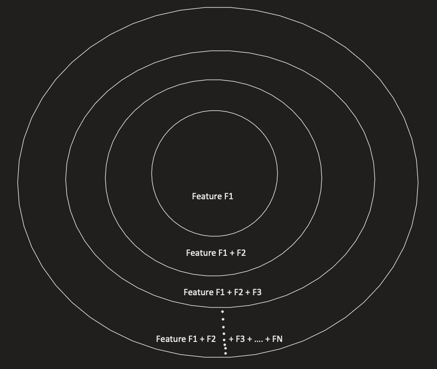
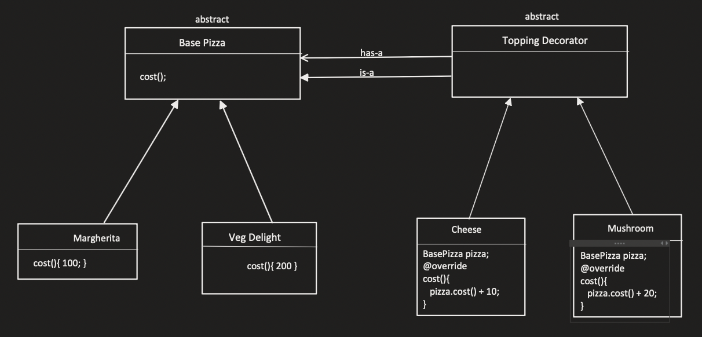

# Decorator

## Why you need a decorator pattern?
There can be many permutation combinations of many classes, for example Pizza can be a base class and topings can be the sub classes, now there can be multiple topings and there will be a lot of combinations

## How?
- There is a base class (Abstract) Base Pizza, now there are two pizza types let's say, these are Margherita and Veg delight now it can have topings on top of it.

Now there can be multiple topings so we won't be creating class for every one of them, instead, we will create a decorator, lets say TopingDecorator which will be an abstract class.

- now the topings itself will be an object so it has a base pizza and it itself is a pizza

## How to use?
Let's say you need Margherita + ExtraCheese, how do we do it?
- BasePizza pizza = new ExtraCheese(new Margherita());
- pizza.cost()