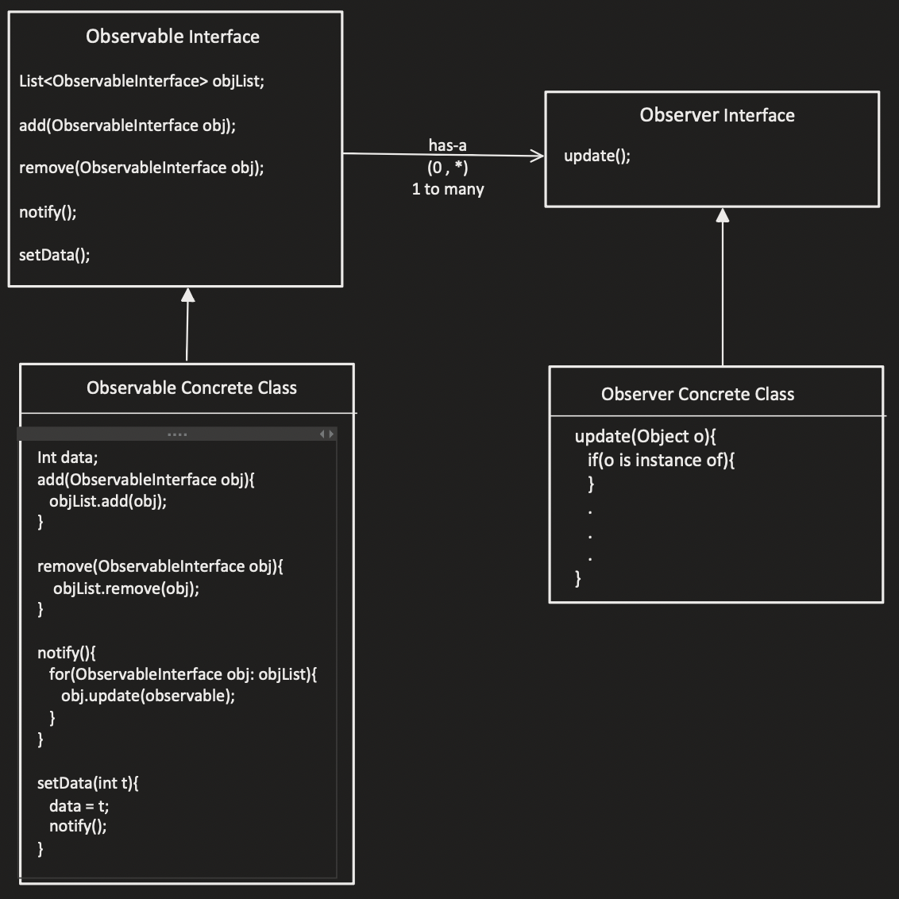
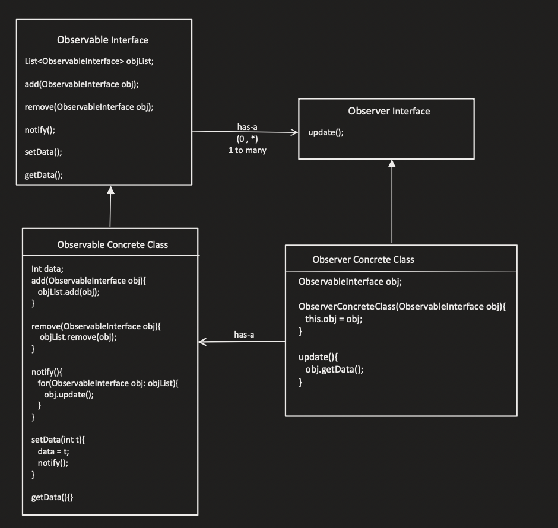
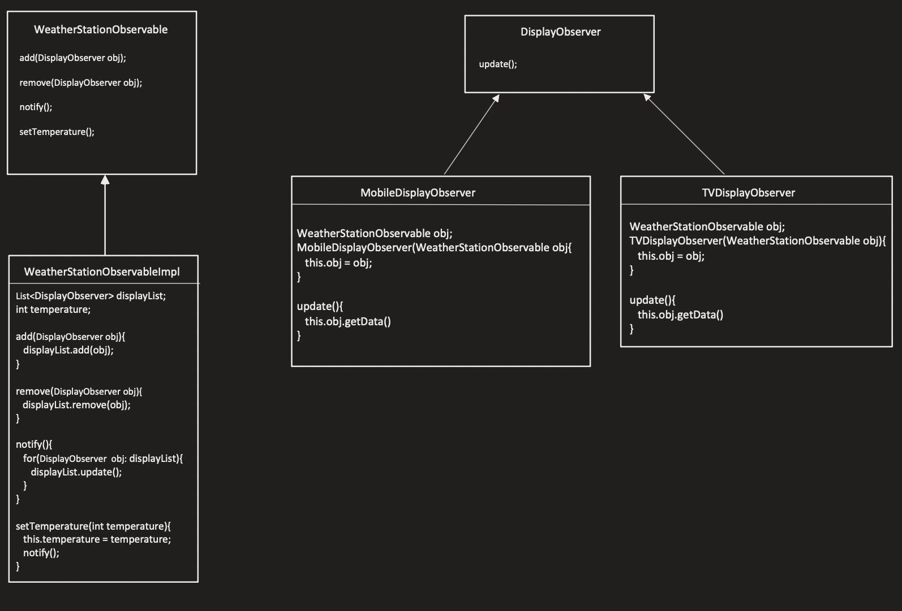

# Observer Design Pattern

We have two objects in Observer Design Pattern:
1. Observable
2. Observer

- So there can be multiple Observer which is observing the observable
- There are multiple states on the observable as and when the state changes in the observable, it will update the observers.

There is Observable Interface and a Obeserver Interface.

Observable interface has the following methods:
- add(ObserverInterface obj)
    - also known as registration
- remove(ObserverInterface obj)
- notify()

Observer interface has the following methods:
- update()

The update method needs to know about which observable has been updated and hence we need to pass the observable in the update function of Observer

But here the issue is that we need to check the instance of the object with their respective class type which is not an ideal way.

To tackle this problem we build a has-a relationship for Observer Concrete Class, that is Observer Concrete Class has a Observer Concrete Class

Example:
- There is a weather station, which has to set the temperature in the interval of 1 hour.
- WeatherStationObservable is being observed by:
    - TvDisplayObserver
    - MobileDisplayObserver

So WeatherStationObservable will update the temperature and and also update TvDisplayObserver and MobileDisplayObserver when it gets updated

## Implement Notify Me (Walmart Interview Question)
When you visit a website when a product is out of stock, there is an option called Notify Me, Implement it.

