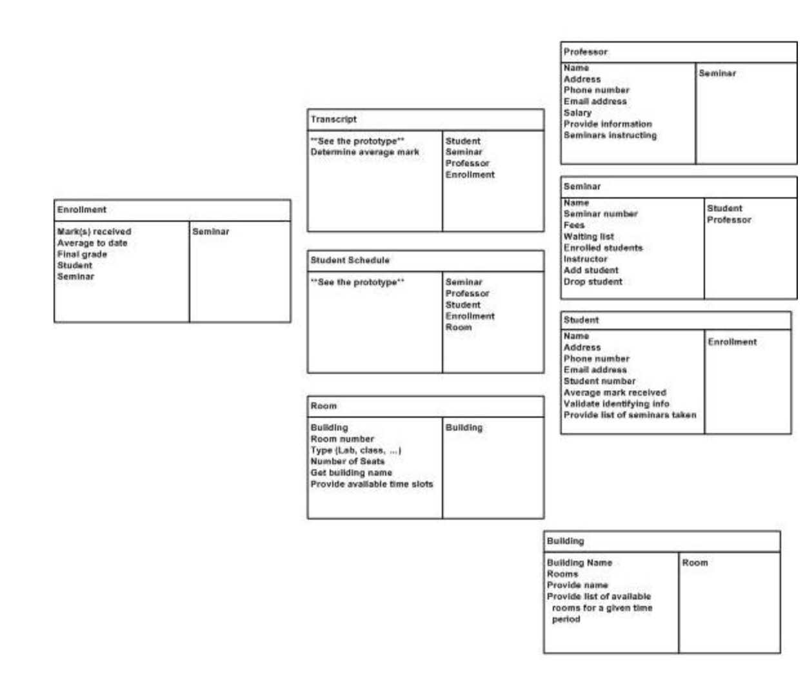

## Object Oriented Programming
### Expressing Requirements
*As a ______, I want to ________ so that ______.*
- blank1 => what is the role of user
- blank2 => goal that the user role  wants to achieve
- blank3 => reason why the user role wants this goal
Example:
As an **Online Shopper** I want to **add** an item to my shopping cart, so that I can **purchase** it.
Verbs help you identify the requirements that your objects might have, also identifies the connections between objects.
For example:
- "add" and "purchase" might be the responsibilities of shopping cart.
- One online shopper is typically linked with one shopping cart.

-------------------------
Noun corresponds to objects in your software. In the above example, I have identified three nouns:
- Online Shopper
- Item
- Shopping Cart

Verbs can help you to identify the requirements that your objects might have. In the above example.
Shopping Cart has the following responsibilities:
- add
- purchase

Verbs can also help to identify the connections between objects. In the above example, the connections can be following:
- One online shopper is typically associated with one shopping cart
- one cart should be caoable of holding multiple items

**NOTE:** User Strories are just one of many techniques that can be used to express requirements for a software system. Advantages:
- Simple to use
- can allow to apply object oriented thinking
- discover objects, requirements and connection

This helps to keep software well structured and more clear

### Categories of Objects in Design
Generally three categories of objects:
- **Entity Objects:**
    
    They correspond to some real-world entity in the problem space. Object representing a chair, building, customer are entity objects.

    These objects will know attributes of themselves, also able to modify themselves, and have some rules to do so.

    While identifying the objects in software, breaking down the objects into smaller objects will get you the entity objects

- **Boundary Objects:**

    These objects sit at the boundary between systems. This could be an object which deals with another software system(like an object that obtains information from the internet) It could also be an object with responsibility of showing information to the user and getting their input.

    Any object that deals with another system - a user, another software system, the internet, can be considered as boundary object
- **Control Objects:**
    
    Control Objects are objects which are responsible for coordination. Contol objects cab be discovered when you attempt to breakdown a large object and find that it would be useful to have an object that controls other objects.

    Example: Mediator, it simply coordinates the activities of many different objects so that they can stay **loosely coupled**

### Competing Qualities
- Performance
- Convenience
- Security

## Qualities:
- Functional Requirements: Describes what the system or application is expected to do.
Software solution should aligned to meet such requirements.

    Example: A media app has a functional requirement to download a full length movie.

    **Key Quality:** Correctness

- Non-Functional Requirements: Specifies how well the system or application does what it does. Such requirements may describe how well the software runs in particular situations.

    Example: Download movie at a specific speed and play the movie within certain memory limit. 

    **Key Quality:** Correctness, Performance, Resource Usage, Efficiency

 

Other Qualities:
- Reusuability
- Flexibility
- Maintainability

### Record, Organize, and Refine Components
**CRC Cards: Class, Responsibility, Collaborator**
helps to oganise components, identify responsibilities and determine how they collaborate
