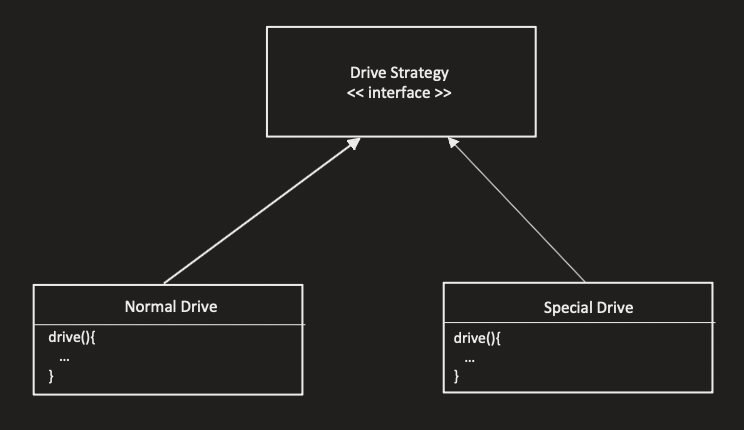
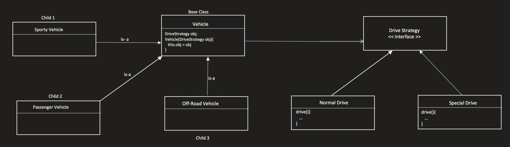

# Strategy Design pattern

## Problem

Here is a diagram
- Base Class Vehicle is inherrited by Sporty vehicle, Passenger Vehicle, Off-Road Vehicle
- Lets say the special capability of Sporty Vehicle is same as the Base class's one, so it's a duplicate code
- if there were more features in Base class and the child classes had to override it, it might happen that several child classes has the same requirements and that leads to duplicacy of code
- so the issue is when the sibling childs are having the same capabilities that are being overriden 

## Solution

- I can create an interface Drive Stratgey which will be extended by multiple concrete classes so that if in future any new Drive Stratgey comes in it won't get affected which can implement the drive() method according to it's way.
- Previously we were mentioning the capability on the base class which was wrong, here we will define a relationship that "Vehicle" has-a "DriveStrategy" interface
- Which DriveStrategy will be decided by the child class.
- The base class will take a parameter DriveStrategy in its constructor(this process is called as Constructor Injection) which will assign the drive strategy

## When to use Strategy Design Pattern
- When I am making a parent child relationship, and the child are having same code / functionality which is not present in the base